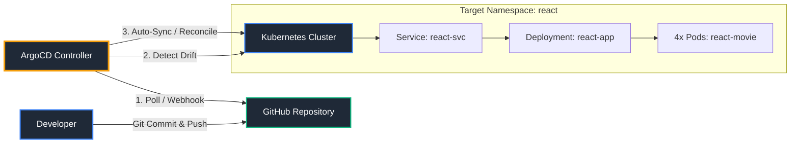
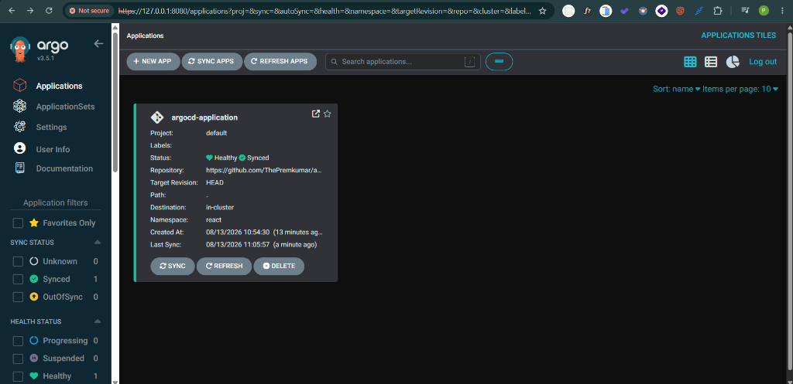
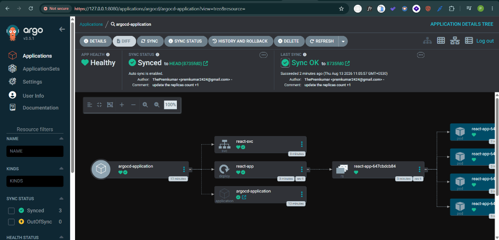

# 🚀 GitOps Continuous Delivery with ArgoCD & Kubernetes

[](https://kubernetes.io/)
[](https://argoproj.github.io/cd/)
[](https://react.dev/)
[](https://www.docker.com/)

This repository implements a declarative, **GitOps-driven continuous delivery** pipeline deploying a React Movie Web Application onto a Kubernetes cluster. Synchronization, configuration drift detection, and deployment lifecycle management are automated entirely by **ArgoCD**.

---

## 📌 Table of Contents
- [Architecture & GitOps Workflow](#-architecture--gitops-workflow)
- [Repository Structure](#-repository-structure)
- [Kubernetes Resources Breakdown](#-kubernetes-resources-breakdown)
  - [1. ArgoCD Application (`application.yaml`)](#1-argocd-application-applicationyaml)
  - [2. App Deployment (`deployment.yaml`)](#2-app-deployment-deploymentyaml)
  - [3. Cluster Service (`service.yaml`)](#3-cluster-service-serviceyaml)
- [Prerequisites](#-prerequisites)
- [Quick Start Guide](#-quick-start-guide)
- [ArgoCD Dashboard Showcase](#-argocd-dashboard-showcase)
- [GitOps Best Practices Implemented](#-gitops-best-practices-implemented)

---

## 🏗️ Architecture & GitOps Workflow

The deployment relies on the Pull-based GitOps model. Rather than pushing changes directly to the Kubernetes cluster using CI/CD runner keys, ArgoCD actively monitors this repository and pulls changes to reconcile state.



---

## 📂 Repository Structure

```bash
.
├── README.md               # Documentation
├── application.yaml        # ArgoCD Application CRD definition
├── deployment.yaml         # Kubernetes Deployment (React frontend app)
├── service.yaml            # Kubernetes Service definition
└── images/                 # Active environment execution screenshots
    ├── argocd-applications-list.png
    └── argocd-application-details.png
```

---

## ⚙️ Kubernetes Resources Breakdown

### 1. ArgoCD Application (`application.yaml`)
Automates resource synchronization from git path `.` to target namespace `react` inside the target cluster:
- **`prune: true`**: Automatically cleans up legacy/deprecated resources that are removed from Git.
- **`selfHeal: true`**: Reconciles cluster resources back to Git state if manual modifications or configurations are applied in the cluster (prevents configuration drift).
- **`CreateNamespace=true`**: Automatically spins up the target namespace `react` if it doesn't already exist.

### 2. App Deployment (`deployment.yaml`)
Configures a high-availability React Movie application:
- **Replicas**: `4` pods for failover safety and traffic management.
- **Container Registry Image**: `thepremkumar/react-movie:v1`.
- **Ports**: Exposes port `80` container port.

### 3. Cluster Service (`service.yaml`)
Defines the network routing policies:
- **Service Type**: ClusterIP (Default internal routing layer).
- **Selector**: Target matching label `app: react-app` pods.
- **Port Mapping**: Service port `80` routes to container port `8080`.

---

## ⚡ Prerequisites

Before launching this project, ensure you have:
1. A running Kubernetes cluster (e.g., Minikube, Kind, EKS, GKE, AKS).
2. `kubectl` CLI configured.
3. ArgoCD installed in your cluster (usually in the `argocd` namespace).

---

## 🚀 Quick Start Guide

### Step 1: Install ArgoCD (if not already installed)
```bash
kubectl create namespace argocd
kubectl apply -n argocd -f https://raw.githubusercontent.com/argoproj/argo-cd/stable/manifests/install.yaml
```

### Step 2: Access the ArgoCD UI
To access the server dashboard, port-forward the ArgoCD Server Service:
```bash
kubectl port-forward svc/argocd-server -n argocd 8080:443
```
Open your browser and navigate to `https://localhost:8080`.

### Step 3: Deploy the ArgoCD Application definition
Deploy the ArgoCD bootstrap application manifest directly:
```bash
kubectl apply -f application.yaml
```
ArgoCD will automatically create the `react` namespace, fetch the manifests, and provision the deployment and service.

---

## 🖥️ ArgoCD Dashboard Showcase

Once applied, the application's synchronization status can be monitored directly in the ArgoCD web console:

### Applications Overview
Demonstrates that the `argocd-application` is fully synchronized (`Synced`) and in a `Healthy` state:



### Resource Tree Mapping
A visual tree indicating the relationship between the ArgoCD Application parent node, the Service, the Deployment controller, the ReplicaSet, and the 4 healthy underlying Pods:



---

## 🛡️ GitOps Best Practices Implemented

- **Infrastructure as Code (IaC)**: The entire cluster topology is stored as code.
- **Declarative State**: Cluster configurations match the single source of truth (this Git repository).
- **Self-Healing Loop**: Manual changes to cluster configurations are immediately reverted to match the files stored in Git.
- **Automated Pruning**: Eliminates dangling infrastructure objects automatically.
- **Namespace Isolation**: Separates dev/production apps into dedicated logical boundaries (`react`).
